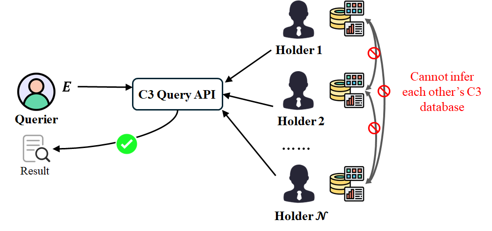

# MPMT — Multi-party Private Membership Test


This repository is a research prototype for the **Multi-party Private Membership Test (MPMT)** problem under the semi-honest security model: multiple set holders each contribute a private set, and a querier can test whether an element belongs to the union of those sets. MPMT aims to answer membership queries while:

1. not revealing the holders' private sets to the querier;
2. not revealing the element being queried to the set holders.

The project provides two parts:

1. the multi-party computation building blocks and the protocol family MPMT needs, packaged as a standalone Python package **`mpmt`**, with detailed usage documentation in [`tutorial/`](./tutorial/);
2. a **single-machine simulation application** for the **Compromise Credential Checking (C3)** scenario (see the figure below), built on the `mpmt` Python interface. Under the non-collusion assumption of the three proxy servers (Agent Server: Steward, Peer0 & Peer1) and the semi-honest security model, the compromised credential databases (i.e. the Set Holder role in MPMT) contribute the shares of their own sets without revealing their data; a querier (i.e. the Querier role in MPMT) tests whether a private credential that must not be disclosed appears in those databases. The proxy servers securely aggregate the set shares of the compromised credential databases and provide the query capability on the querier's behalf.



## Project structure

```
  ┌─ Application layer ─────────────────────────────────────────────┐
  │  manage_server                                                  │
  │  agent_server ×3 — STEWARD / PEER0 / PEER1                      │
  │  set_holder · querier                                           │
  ├──MPMT protocol package ─────────────────────────────────────────┤
  │  Python API: AgentServer · SetHolder · Querier · _TreeCache     │
  │  Channel · Rvector · ShrRep3 · ShrAdd2 · Dpf · RingTransport    │
  ├─ C++ bindings ──────────────────────────────────────────────────┤
  │  nanobind · shared_ptr · IOChannel                              │
  ├─ C++ core ──────────────────────────────────────────────────────┤
  │  ABY3        3-party replicated RSS                             │
  │  EMP2        2-party additive sharing                           │
  │  BGI16       distributed point function                         │
  │  Utils (Rvector, RingTransport, etc.)                           │
  └─────────────────────────────────────────────────────────────────┘
```

The diagram above shows the overall architecture. The lower three layers are bundled in the `mpmt` package, which contains the reusable MPMT protocol implementations and can be used independently of this project's application layer. It exposes MPC building blocks and the high-level protocol objects the application uses through a Python interface; the low level is a C++20 core bound to Python with nanobind.

Basic examples and protocol-level usage are in [`tutorial/`](./tutorial/):
- [`tutorial/README.md`](./tutorial/README.md) — Python interface overview;
- [`tutorial/base/`](./tutorial/base/) — basic data structures and ring operations;
- [`tutorial/building_blocks/`](./tutorial/building_blocks/) — MPC building blocks;
- [`tutorial/net/`](./tutorial/net/) — communication Channels and network transport.

The application layer is built entirely on top of `mpmt`. It provides a directly runnable local simulation environment, using the C3 scenario as an example, to simulate a complete MPMT system. The system contains:

| Component | Role |
|---|---|
| `pretreat` | generates the datasets, protocol parameters and a clean storage environment for a fresh run |
| `steward` / `peer0` / `peer1` | the Agent Server |
| `manage_server` | coordinates application operations, task scheduling, Agent connections and explicit TreeCache sync |
| `set_holder` | executes set-holder operations: `JOIN`, `UPDATE` and `QUIT` |
| `querier` | executes membership queries |

All processes of this example application can run on a single machine, but the structure and configuration remain logically independent.

## Example application in the C3 scenario
### Business flow

A fresh application run starts with preprocessing — `pretreat` — which generates the users, datasets, storage directories and protocol parameters needed by the local simulation.

Then the three MPC Agents are started: `STEWARD`, `PEER0`, `PEER1`. Each Agent maintains its own local protocol state and TreeCache shares. Manage Server connects to the three Agents and provides an HTTP interface plus an application-layer scheduler. Manage Server receives business requests through the HTTP interface (merging database requests, updating sets, and querier requests to query a private element), and its application-layer scheduler then dispatches the three proxy servers to establish TCP connections with the databases (set holders) / queriers and run the protocols.

Set holders can modify the shared membership structure through the following operations:

```text
JOIN
UPDATE
QUIT
```

JOIN adds a new compromised credential database to the service; UPDATE lets a database already in the service refresh its own set; QUIT lets a database leave the service. These operations update the TreeCache state but **do not update the aggregate shares** — aggregation must be explicitly triggered by Manage Server's `SYNC` sync task. When Manage Server runs `ms sync` (see [Manage Server commands](#8-supplementary-manage-server-commands) below for the full command reference), the `SYNC` task has the highest priority: it is scheduled **after the currently running operation and before any other queued business operation**. After the sync completes, a querier can run `QUERY` and obtain the membership result:

```text
1  -> belongs to the set
0  -> does not belong to the set
```

The application persists both the Manage Server state and the Agent Server state. Therefore, restarting the application after a normal shutdown does not require re-running `pretreat`; `pretreat` only initializes a task (building the sets, creating the storage directories, etc.) so that every experiment starts from a clean environment.

When the last set holder quits, the next `ms sync` aggregates the empty-set state and deletes the previously aggregated TreeCache root.

### Running the application

#### 1. Build and install `mpmt`

`mpmt` is a C++20 extension (bound with nanobind); building it needs a C++
toolchain and emp-toolkit in addition to `pip`.

Prerequisites (Ubuntu 22.04):

```bash
# system toolchain + crypto / JSON libraries
sudo apt-get install -y clang-15 cmake ninja-build \
    libsodium-dev nlohmann-json3-dev libssl-dev python3-pip

# emp-toolkit (emp-tool, emp-ot, emp-sh2pc) built from source
.github/install-deps.sh emp-tool
.github/install-deps.sh emp-ot
.github/install-deps.sh emp-sh2pc
```

Then build and install the package:

```bash
pip install -e . -v
```

> The GitHub Actions workflow (`.github/workflows/ci.yml`) performs exactly
> these steps — see it for the current dependency list.

#### 2. Clean the task environment

```bash
cd application
python3 run.py pretreat -f
```

This command generates the users, datasets, protocol parameters and a fresh local storage state the application needs.

#### 3. Start the three MPC Agents

Run these in three separate terminals:

```bash
python3 run.py steward
```

```bash
python3 run.py peer0
```

```bash
python3 run.py peer1
```

#### 4. Start Manage Server

Open another terminal and run:

```bash
python3 run.py manage_server
```

Manage Server enters an interactive console:

```text
c3-manager>
```

Start the backend service and connect to the three Agents:

```text
c3-manager> ms start
```

Running `ms start` again does not start a second scheduler or a second HTTP service.

#### 5. Run set-holder operations

User IDs are generated automatically by `pretreat`.

Add a set holder:

```bash
python3 run.py set_holder -e JOIN <user_id>
```

Replace the holder's current set:

```bash
python3 run.py set_holder -e UPDATE <user_id>
```

Remove the holder:

```bash
python3 run.py set_holder -e QUIT <user_id>
```

`JOIN`, `UPDATE` and `QUIT` never automatically aggregate a new TreeCache root.

#### 6. Aggregate pending changes

In the Manage Server console:

```bash
ms sync
```

After a set holder changes its set, run `ms sync` if you want those changes to enter the queryable aggregated state.

#### 7. Run a membership query

```bash
python3 run.py querier -e QUERY <user_id> <element>
```

The query result contains the membership bit for the element.

#### 8. Supplementary: Manage Server commands

The interactive Manage Server is the main control entry of the local application.

| Command | Description |
|---|---|
| `ms start` | connect to the three Agents and start the Manage Server backend |
| `ms status` | show the Manage Server state and each Agent's connection state |
| `ms sync` | sync the TreeCache and aggregate the current state |
| `ms log` | show recent Manage Server logs |
| `ms exit` | stop the Manage Server |
| `help` | list the available commands |

## Tests

The test suite lives in [`tests/`](./tests/) and is organised into three layers by **system under test**:

| Layer | Directory | System under test |
|---|---|---|
| mpmt building blocks | `tests/mpmt_components/` | Rvector / Channel / RingTransport / util / ABY3 / EMP2 / DPF / ring_conv / reveal-flush / hash / 3-party TCP |
| mpmt high-level protocols | `tests/mpmt_protocols/` | SetHolder / Querier / AgentServer / TreeCache (incl. last-leaf no-tree) / BF aggregation |
| application | `tests/app/` | Manage Server state machine / FIFO / single-active scheduling / explicit `ms sync` / restart persistence |

**Full usage and details are in [`tests/README.md`](./tests/README.md)** (old→new mapping, per-layer system under test, Stack lifecycle, coverage comparison).

```bash
# everything (all three layers in order; judged purely by subprocess return code)
python3 tests/run_all.py

# per layer
python3 tests/run_components.py [--small]
python3 tests/run_protocols.py
python3 tests/run_app.py
```

`mpmt` is an installable Python package (`pip install -e .`); use the `python3` of any environment that has it installed.

Application-layer tests **automatically start the services they need** (fresh pretreat + the three Agents + Manage Server `ms start`, plus automatic `ms sync` / automatic restart where needed) — no manual terminals required.

## Disclaimer

This code is intended solely for **ACADEMIC RESEARCH PURPOSES** and has not undergone a formal **PRODUCTION SECURITY AUDIT**. It is provided **"AS IS,"** without any **EXPRESS OR IMPLIED WARRANTIES**. **USE IT AT YOUR OWN RISK.**

## References

- ABY3 (Mohassel & Rindal, CCS 2018): 3-party replicated secret sharing
- BGI16 DPF (Boyle, Gilboa & Ishai, CCS 2016): function secret sharing
- emp-toolkit: https://github.com/emp-toolkit
- SIMD packing inspired by [lemire/simdcomp](https://github.com/lemire/simdcomp)
